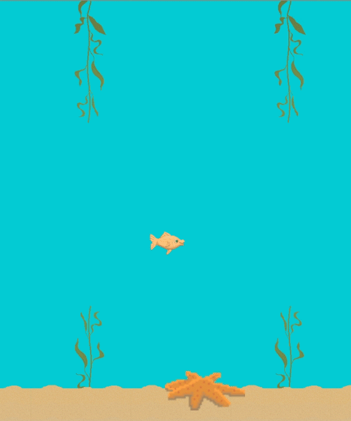

# Flappy-Clone

A simple clone of the popular mobile game "Flappy Bird". 

## Tools used
[GIMP](https://www.gimp.org/)
[Unity](https://unity.com/)

### Note
The version of unity used was 2019.3.0a2

## Background

I decided to develop this project as a means to learn some unity game development and C#.

The project itself is rather simple, most of the work pertained to learning the unity environment and creating the game assets using GIMP.

## Useful Links

-A Udemy course I found quite useful for my learning [Link](https://www.udemy.com/course/the-ultimate-guide-to-game-development-with-unity/?utm_source=adwords-learn&utm_medium=udemyads&utm_campaign=NEW-AW-PROS-TECH-ROW-DSA-1-EN-EURO_._ci__._sl_ENG_._vi_TECH_._sd_All_._la_EN_._&utm_content=deal4584&utm_term=_._ag_57696320151_._ad_318300707729_._de_c_._dm__._pl__._ti_dsa-796176361085_._li_1007850_._pd__._&gclid=EAIaIQobChMIufXDpqzg5gIVQuDtCh2KHwA-EAAYAiAAEgLnlPD_BwE)
-A tutorial from the unity website that helps break you into the unity dev environment [Link](https://unity.com/how-to/make-games-without-programming)
-A youtube channel with various interesting game dev videos and tutorials [Link](https://www.youtube.com/watch?v=on9nwbZngyw)
